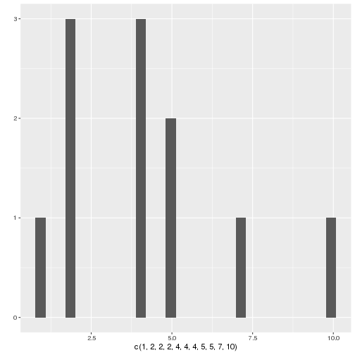
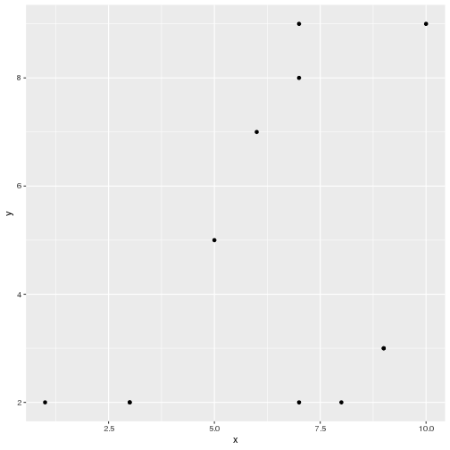
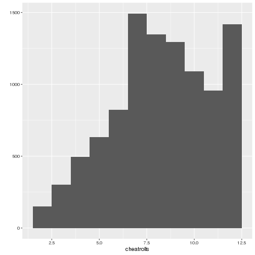

test-slides.Rmd
========================================================
author: 
date: 
autosize: true

R Workshop
========================================================

WHO AM I
========================================================

WHO ARE YOU
========================================================

What Is R?
========================================================

Why R?
========================================================

Other software
========================================================
incremental: true

- Python
- Julia
- Tableau
- PowerBI etc

PYTHON IS BETTER (usually)
========================================================

RStudio
========================================================

Rstudio cloud
========================================================   
 https://rstudio.cloud

R ITSELF
========================================================
incremental: true


```r
1 + 2
```

```
[1] 3
```


Making Dice
========================================================
incremental: true


```r
dice <- c(1,2,3,4,5,6)
dice
```

```
[1] 1 2 3 4 5 6
```

```r
dice <- 1:6
dice
```

```
[1] 1 2 3 4 5 6
```

What are functions?
========================================================

Let's make a function!
========================================================
incremental: true


```r
hello <- function(name="Access Attendee") {
  paste("Hello, ", name, "!", sep="")
}
hello()
```

```
[1] "Hello, Access Attendee!"
```

- How can we run this and change the name?


Rolling the Dice
========================================================
incremental: true


```r
roll <- function(die = 1:6, rolls = 2) {
  dice <-sample(die, size = rolls)
  dice
}
roll()
```

```
[1] 5 2
```
- How can we change the number of dice sides? The number of rolls?
- Roll the dice a few times. Can you spot anything weird?

Fixing our Dice
========================================================
incremental: true


```r
roll <- function(die = 1:6, rolls = 2) {
  dice <- sample(die, size = rolls, replace = TRUE)
  dice
}
roll()
```

```
[1] 4 4
```

Let's make the function do the adding
========================================================

```r
roll <- function(die = 1:6, rolls = 2) {
  dice <- sample(die, size = rolls, replace = TRUE)
  sum(dice)
}
roll()
```

```
[1] 4
```

Let's make graphs!
========================================================

What are packages?
========================================================

```r
install.packages("tidyverse")
library(tidyverse)
```

Quick and Dirty Plotting with a Single Vector
========================================================


```r
qplot(c(1,2,2,2,4,4,4,5,5,7,10))
```



Quick and Dirty Plotting with Two Vectors
========================================================

```r
x <- c(1,3,3,5,6,7,7,7,8,9,9,10)
y <- c(2,2,2,5,7,8,9,2,2,3,3,9)
qplot(x,y)
```




Rolling many times
========================================================
incremental: true


```r
replicate(10, roll())
```

```
 [1] 9 9 7 6 5 3 7 6 8 5
```
- What happens if we change the first variable? 
- Can we adjust the parameters of roll()?

Plotting dice rolls
========================================================
incremental: true


```r
rolls <- replicate(10000, roll())
```

Plotting dice rolls 2
========================================================


```r
qplot(rolls, binwidth=1)
```

Plotting dice rolls 3
========================================================


Let's cheat
========================================================

```r
rollcheat <- function(die = 1:6, rolls = 2) {
  dice <- sample(die, size = rolls, replace = TRUE, prob = c(1/8, 1/8, 1/8, 1/8, 1/8, 3/8))
  sum(dice)
}
rollcheat()
```

```
[1] 9
```

Plotting cheating rolls
========================================================

```r
cheatrolls <- replicate(10000, rollcheat())
qplot(cheatrolls, binwidth = 1)
```
- What is the graph going to look like now?

WE ARE ALL NOW MILLIONAIRES
========================================================
title: false


