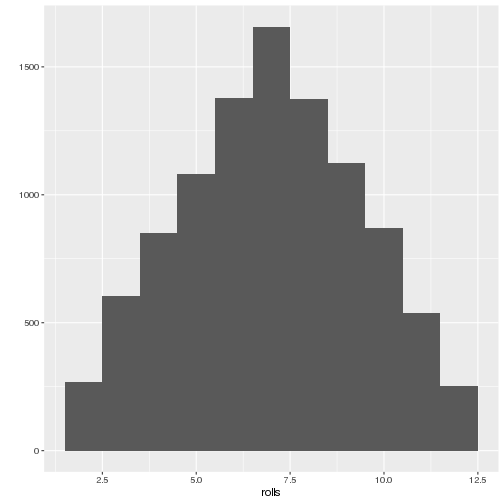
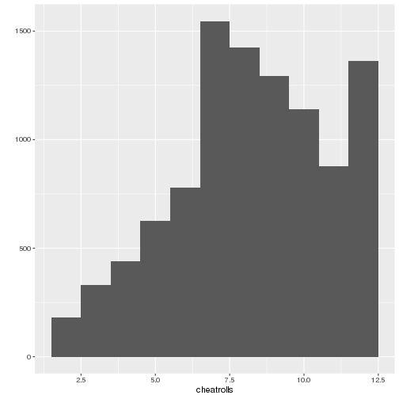
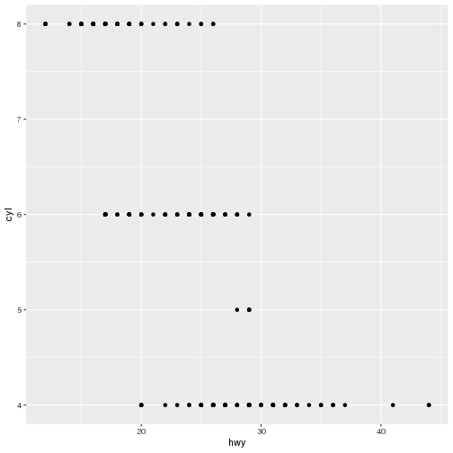
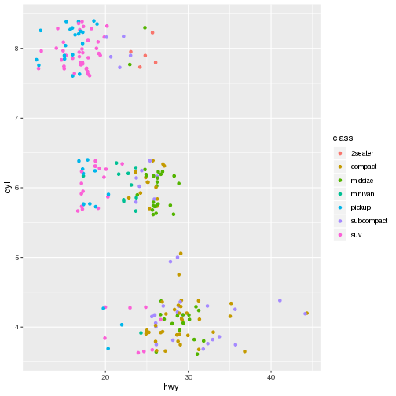

How to Draw an Owl Workshop, Access 2019
========================================================
author: 
date: 
autosize: true

How to draw an owl
========================================================


R Workshop
========================================================

WHO AM I
========================================================

WHO ARE YOU
========================================================

What Is R?
========================================================
incremental: true

- It's a *programming language* for statistical computing and visualization
- You can think of it as a *domain specific language* for stats and visualization, like Rails is for web development.

Why R?
========================================================

Other software
========================================================
incremental: true

- Python
- Julia
- Tableau
- PowerBI etc

PYTHON IS BETTER (usually)
========================================================

RStudio
========================================================

Rstudio cloud
========================================================   
 https://rstudio.cloud

R ITSELF
========================================================
incremental: true


```r
1 + 2
```

```
[1] 3
```


Making Dice
========================================================
incremental: true


```r
dice <- c(1,2,3,4,5,6)
dice
```

```
[1] 1 2 3 4 5 6
```

```r
dice <- 1:6
dice
```

```
[1] 1 2 3 4 5 6
```
- These are *vectors*, which is what R calls one-dimensional lists of things.
- What's with the weird "<-" thing? Why not *=* as in every other language ever invented in the history of languages?

What are functions?
========================================================

Let's make a function!
========================================================
incremental: true


```r
hello <- function(name="Access Attendee") {
  paste("Hello, ", name, "!", sep="")
}
hello()
```

```
[1] "Hello, Access Attendee!"
```
- Let's break this down:
- *hello* -- the name of the function. This is an arbitrary name and can be almost anything.
- <- the assignment operator
- *function* - telling R we are building a function
- *name* - a variable to pass to the function. Functions can have multiple variables!


Let's make a function!
========================================================
incremental: true


```r
hello <- function(name="Access Attendee") {
  paste("Hello, ", name, "!", sep="")
}
```

- *paste* - to *concatenate* vectors
- "Hello, " a string
- *name* again - the variable for the function. It can change!
- "!", another string the end of our sentence.
- *sep*, a flag for paste to tell it what the separator is. In this case, we don't want any separator.
- Why did I write this function with "Access Attendee" in it?
- How can we run this and change the name?


Rolling the Dice
========================================================
incremental: true


```r
roll <- function(die = 1:6, rolls = 2) {
  dice <-sample(die, size = rolls)
  dice
}
roll()
```

```
[1] 1 6
```
- How can we change the number of dice sides? The number of rolls?
- Roll the dice a few times. Can you spot anything weird?

Fixing our Dice
========================================================
incremental: true


```r
?sample
```


```r
roll <- function(die = 1:6, rolls = 2) {
  dice <- sample(die, size = rolls, replace = TRUE)
  dice
}
roll()
```

```
[1] 1 5
```

Let's make the function do the adding
========================================================

```r
roll <- function(die = 1:6, rolls = 2) {
  dice <- sample(die, size = rolls, replace = TRUE)
  sum(dice)
}
roll()
```

```
[1] 12
```

Let's make graphs!
========================================================

What are packages?
========================================================

```r
install.packages("tidyverse")
library(tidyverse)
```

Quick and Dirty Plotting with a Single Vector
========================================================


```r
qplot(c(1,2,2,2,4,4,4,5,5,7,10))
```


Quick and Dirty Plotting with Two Vectors
========================================================

```r
x <- c(1,3,3,5,6,7,7,7,8,9,9,10)
y <- c(2,2,2,5,7,8,9,2,2,3,3,9)
qplot(x,y)
```


Rolling many times
========================================================
incremental: true


```r
replicate(10, roll())
```
- What do you think this does?

```
 [1]  3  9 11  5  8  4 12  7  8  8
```

- What happens if we change the first variable? 
- Can we adjust the parameters of roll()?

Plotting dice rolls
========================================================
incremental: true


```r
rolls <- replicate(10000, roll())
```

Plotting dice rolls 
========================================================
incremental: true


```r
qplot(rolls, binwidth=1)
```
- Without actually running this, what do you think this bar graph will look like?

Plotting dice rolls 
========================================================


Let's cheat
========================================================
incremental: true


```r
rollcheat <- function(die = 1:6, rolls = 2) {
  dice <- sample(die, size = rolls, replace = TRUE, prob = c(1/8, 1/8, 1/8, 1/8, 1/8, 3/8))
  sum(dice)
}
rollcheat()
```

```
[1] 4
```
- How can we change which side is weighted?

Plotting cheating rolls
========================================================
incremental: true 


```r
cheatrolls <- replicate(10000, rollcheat())
qplot(cheatrolls, binwidth = 1)
```
- What is the graph going to look like now?

WE ARE ALL NOW MILLIONAIRES
========================================================
title: false



Using more complicated data
========================================================
incremental: true 

```r
mpg
```

```
# A tibble: 234 x 11
   manufacturer model displ  year   cyl trans drv     cty   hwy fl    class
   <chr>        <chr> <dbl> <int> <int> <chr> <chr> <int> <int> <chr> <chr>
 1 audi         a4      1.8  1999     4 auto… f        18    29 p     comp…
 2 audi         a4      1.8  1999     4 manu… f        21    29 p     comp…
 3 audi         a4      2    2008     4 manu… f        20    31 p     comp…
 4 audi         a4      2    2008     4 auto… f        21    30 p     comp…
 5 audi         a4      2.8  1999     6 auto… f        16    26 p     comp…
 6 audi         a4      2.8  1999     6 manu… f        18    26 p     comp…
 7 audi         a4      3.1  2008     6 auto… f        18    27 p     comp…
 8 audi         a4 q…   1.8  1999     4 manu… 4        18    26 p     comp…
 9 audi         a4 q…   1.8  1999     4 auto… 4        16    25 p     comp…
10 audi         a4 q…   2    2008     4 manu… 4        20    28 p     comp…
# … with 224 more rows
```
- *mpg* is a *data frame* or, in Tidyverse-speak, a *tibble*
- it's basically a spreadsheet.


The View function makes this a little more palatable
========================================================

```r
View(mpg)
```

Doing something interesting with the dataset
========================================================
incremental: true

- How can we determine the median highway gas mileage?

```r
median(mpg %>% pull(9))
```

```
[1] 24
```
- breaking this down:
- *median* -- (a function, to which we pass a vector)
- *mpg* -- (our dataset)
- *%>%* --  a "pipe" through which data is passed (from tidyverse/magrittr)
- *pull* -- a function to convert a table to a vector
- *9* -- we want to convert the ninth column of the *mpg* dataset, which is "hwy".
- You can make this *without* the weird *%>%* pipe thing, but using pipes (usually) makes code much more readable.


How to make graphs if you have no art in your soul
========================================================

```r
library(tidyverse)
?ggplot
```

ggplot
========================================================
incremental: true

- The "gg" stands for *grammar of graphics*
- ggplots are built out of two basic pieces
- the *dataset*, like *mpg*
- the "geom", how to draw the dataset.

ggplot #2
========================================================
incremental: true


```r
ggplot(mpg)
```
- What will this do?
- *Why* did it do that?

ggplot #3
========================================================
incremental: true


```r
ggplot(mpg) + geom_point(aes(x = hwy, y = cyl))
```


- What can we learn from this graph?

adding a third dimension
========================================================
incremental: true


```r
ggplot(mpg) + geom_point(aes(x = hwy, y = cyl, colour = class))
```


another 
========================================================

```r
ggplot(mpg) +  geom_point(aes(x = hwy, y = cty, colour = cyl))
```


Or possibly....
========================================================
incremental: true


```r
ggplot(mpg) + geom_jitter(aes(x = hwy, y = cyl, colour = class))
```


- How does this differ from geom_point? Is it better? 

Linear regression
========================================================

```r
ggplot(mpg) + geom_point(aes(x = displ, y = hwy)) + geom_smooth()
```
- This doesn't work. Why?

Linear regression #2
========================================================

```r
ggplot(mpg, aes(displ, hwy)) + geom_point() + geom_smooth()
```


Why isn't this useful?
========================================================

```r
ggplot(mpg) + geom_point(aes(x = displ, y = hwy))
```

Graphs are objects that you can assign to a name!
========================================================


```r
myGraph <- ggplot(mpg) + geom_point(aes(x = hwy, y = cyl))
myGraph
```


Making things a little clearer with labels
========================================================


```r
myGraph + labs(x = "Highway", y = "Cylinders")
```


And a title!
========================================================


```r
myGraph + labs(x = "Highway", y = "Cylinders", title = "Highway mileage vs. Number of Cylinders")
```


Questions/your own projects????
========================================================
- https://jbfink.github.io/2019-Access-R-Class
